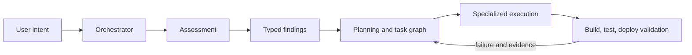
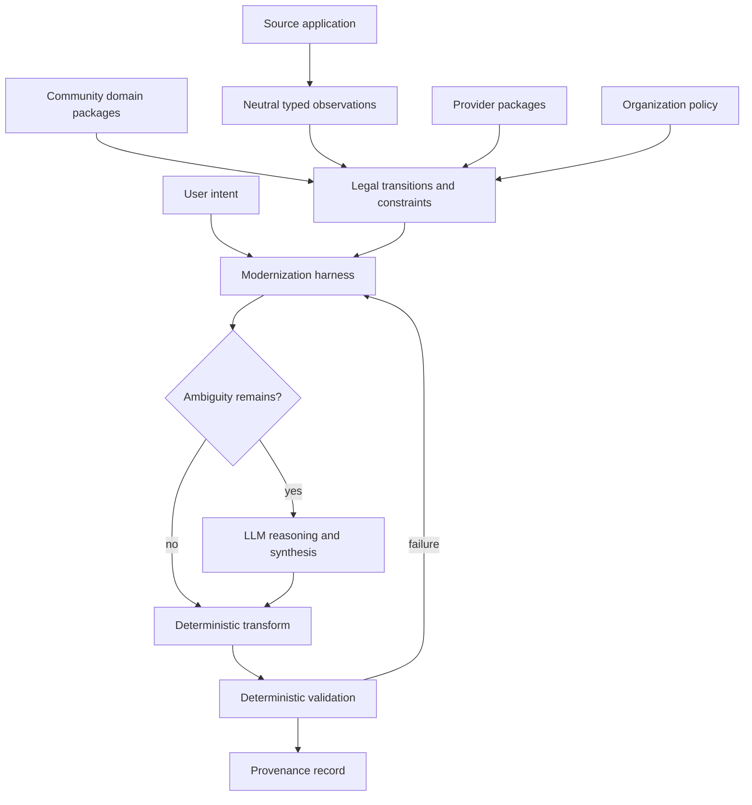
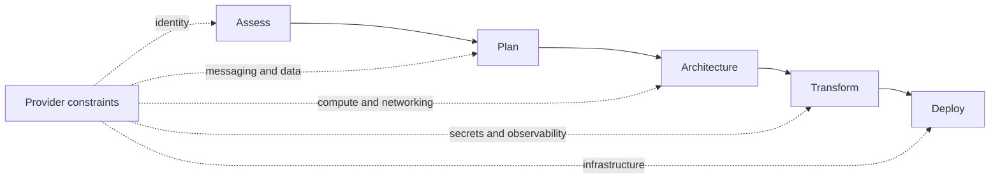

# Architecture

This document separates the pipeline described in the supplied research from the proposed portable architecture. Status labels prevent the proposal from masquerading as product fact.

## Modernize pipeline

**Documented in the supplied research; partly observed through recorded PhotoAlbum notes:**



The repository does not yet include raw assessment, plan, task, or validation artifacts. Claims about exact product behavior therefore retain references to the original notes and await experiment evidence.

## Generic modernization harness

**Proposed architecture:**



The harness owns run state, dependency ordering, approvals, execution, retry, and evidence capture. It consumes domain capabilities rather than treating prompts as the canonical domain model.

## Knowledge layers

| Layer | Examples | Expected owner | Status |
|---|---|---|---|
| Community | Java, .NET, Spring, Jakarta, compatibility rules | ecosystems and maintainers | Proposed |
| Provider | Azure, AWS, GCP service and platform mappings | provider or specialist community | Proposed |
| Organization | security, compliance, approved stacks, exceptions | adopting organization | Proposed |
| User | goal, preferences, constraints | run initiator | Observed concept |
| Harness | state, plan, DAG, retry, provenance, UX | product or open harness | Inferred decomposition |
| LLM | ambiguity, unsupported cases, explanation, synthesis | model plus harness | Inferred role |
| Validation | build, test, policy, deployment checks | deterministic tools | Observed concept |

## Why provider choice enters early

**Inferred:** Deployment execution belongs near the end, while deployment constraints can influence earlier architectural decisions.



The experiment must determine whether Modernize actually introduces these constraints early and whether that happens only after explicit target selection.

## Package architecture

A domain package may expose typed observations, rules and constraints, legal transitions, executable transforms, explanatory knowledge, validators, tests, dependencies, and version compatibility.

Candidate namespaces are illustrative, not implemented:

```text
community/java
community/spring
community/dotnet
microsoft/azure
aws/aws
google/gcp
organization/acme-policy
```

MCP may expose these capabilities, but MCP is a transport contract rather than the knowledge itself. The same package should remain callable from a CLI, library, service, or agent adapter.

## LLM and deterministic roles

Use deterministic software for stable classification, compatibility checks, known transforms, builds, tests, and policy enforcement. Use LLM reasoning for underspecified intent, context-sensitive tradeoffs, unsupported cases, explanation, and synthesis where no reliable transform exists.

This boundary is economic and empirical, not ideological.

## Provenance model

Each consequential observation, recommendation, task, change, and validation result should record:

```text
id
statement or decision
stage
classification
status
source_file
source_section
experiment_id
artifact
observation
confidence
derived_from[]
```

The canonical machine-readable model is in `structured/architecture.json`; claim provenance is in `structured/claims.json` and `structured/provenance.json`.
