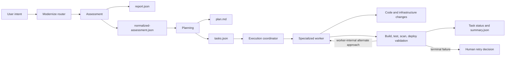

# GitHub Copilot Modernize Archaeology

## Scope and evidence standard

This report maps the public GitHub Copilot Modernization architecture as of 2026-09-23. It separates public implementation artifacts from documentation, prior local observations, and inference. It does **not** claim that a particular installed build follows the public repository at the revision inspected.

Status labels follow `AGENTS.md`: **OBSERVED** means directly present in a repository artifact or captured local note; **DOCUMENTED** means stated in vendor documentation; **INFERRED** is an architectural reading; **UNKNOWN** marks absent evidence.

The public implementation was inspected at commit [`a9c9469d86e9dc078018e8fb391abc7744088078`](https://github.com/microsoft/github-copilot-modernization/tree/a9c9469d86e9dc078018e8fb391abc7744088078). No raw Modernize run artifact is present in this repository, so product-runtime claims remain unverified here.

## Pipeline summary

**OBSERVED:** The public top-level agent is a router. Broad intent follows assessment, a human continue/stop gate, planning, a human execute/review gate, then execution. A specific single task can skip both assessment and planning; multiple specific tasks skip assessment; integration testing still requires planning. Headless mode skips phase gates, not unresolved input.

## Stage model

| Stage | Inputs | Outputs / boundary artifact | Knowledge source | Execution mode and roles | Inspectable / editable | Provenance and surviving evidence | Status |
|---|---|---|---|---|---|---|---|
| Assessment | Repository; user request; explicit config; default domain catalog | AppCAT or NCU output; optional fact/security outputs; HTML report; canonical `report.json`; internal `normalized-assessment.json`; `verification.json` | Plugin catalog and scripts; AppCAT/NCU; optional fact and security skills | **Deterministic:** bootstrap, detection, engine invocation, normalization, artifact verification. **LLM-mediated:** six full-coverage fact skills and six CWE skills. **Human:** explicit scope/config. **Unknown:** internals of AppCAT and model/tool behavior not exposed by artifacts. | Reports and fact files are inspectable. Assessment does not modify source. Inputs are configurable only through supported options. | Run ID, coverage source, report metadata, finding locations, engine outputs, and verification receipt survive. Raw model reasoning does not. | **OBSERVED** in public source; prior PhotoAlbum result **OBSERVED** only in preserved notes. |
| Typed findings | Raw engine and skill results | Public unified `report.json`; internal normalized categories/issues/solutions | Assessment report schema, solution mapping, deterministic normalizer | **Deterministic:** schema shaping, rule/incident identity, target overrides, normalization, verification. **LLM-mediated:** origin of optional AI fact/CWE findings. **Human:** none in normal production. **Unknown:** completeness and false-positive rates. | Public report is inspectable; internal normalized sidecar is deliberately not presented but is a readable file. Neither is documented as a direct-edit surface. | Rule IDs, incident IDs, locations, severity, effort, targets, evidence files, producer, run metadata, and solution/KB IDs can survive. | **OBSERVED.** Earliest typed artifact is raw AppCAT/NCU output; earliest stable public boundary is `report.json`. |
| Planning | Verified normalized assessment, legacy report, or multiple direct tasks; user choices; rulebook; active assessment-memory patches | `plan.md`; `.metadata/tasks.json`; preview and planning summary | Assessment solutions; supported-pattern files; rulebook; user intent; `create-modernization-plan` skill | **LLM-mediated:** synthesis of plan and tasks. **Deterministic:** receipt checks, choice protocol, JSON Schema validation. **Human:** select alternatives and approve execution. **Unknown:** model-specific synthesis and ranking behavior. | `plan.md` and `tasks.json` are inspectable. Vendor docs advise prompting regeneration instead of direct editing because `tasks.json` drives execution and can drift. | Chosen solution and `kbId`, constraints, task requirements, dependencies, skill hints, language, and timestamps survive. Rationale from hidden model reasoning does not. | **OBSERVED** in public source and **DOCUMENTED** by Microsoft Learn. |
| Tasks / DAG | Planning result | Schema-constrained tasks with IDs, types, requirements, dependencies, skills, success criteria, and mutable status fields | Task schema plus planner output | **Deterministic:** dependency and schema contracts. **LLM-mediated:** decomposition and field population. **Human:** indirect changes through plan regeneration. **Unknown:** whether every executor enforces every declared dependency identically. | JSON is inspectable; manual edits are technically possible but not the supported customization workflow. | Task IDs join planning to status, summaries, and validation; dependencies and success criteria persist. Direct single-task mode has no durable planning artifact. | **OBSERVED.** |
| Skills | Task type, task description, optional `kbId`, workspace, constraints | Instructions, scripts, generated artifacts, or worker result | Plugin-shipped Markdown skills, scripts, schemas, supported patterns, knowledge-base references | **Mixed:** some skills are procedural LLM instructions; others invoke deterministic scripts/tools. **Human:** project skills and guidelines can supply policy. **Unknown:** a skill name alone does not locate computation. | Public built-in skills are inspectable; runtime knowledge fetched by a tool may not be. Project guidance is editable. | Skill names and locations may survive in `tasks.json`; execution details survive only when workers persist artifacts or summaries. | **OBSERVED**, with computation location **UNKNOWN** unless a skill/tool implementation is inspected. |
| MCP / tools | Worker request, scenario or `kbId`, workspace, credentials/bindings where needed | Knowledge lookup, analysis, transformation, process, validation, or deployment results depending on tool | App Modernization MCP server and ordinary local/Cloud tools | **Deterministic or service-mediated:** tool-specific. **LLM-mediated:** workers select and interpret calls. **Human:** supplies authorization and unresolved infrastructure data. **Unknown:** server-side algorithms and remote knowledge provenance absent a tool-specific artifact. Assessment explicitly does not use MCP in the inspected revision. | Tool names and parameters may appear in traces; server implementation and transient results may be opaque. | Only persisted tool outputs, changed files, commits, reports, and worker summaries reliably survive. | **OBSERVED** boundary; internals often **UNKNOWN**. |
| Transformation | One task or grouped tasks; source; branch; rulebook; memory patches; KB scenario | Code/config/IaC changes, commits, task result, optional specialized reports | Specialized worker agent, skill, MCP knowledge, repository context, organization rulebook | **LLM-mediated:** source analysis and edits. **Deterministic:** transforms may be delegated to tools such as OpenRewrite; builds and scripts. **Human:** selected scope and constraints. **Unknown:** per-change attribution unless emitted by the worker/tool. | Git diffs and committed changes are inspectable and editable. Worker chain-of-thought and unstored tool outputs are not. | Git history, changed files, worker return, task status, and specialized reports may survive. A universal change-to-rule provenance record is not evident. | **OBSERVED** orchestration; exact computation is task-dependent. |
| Validation | Changed workspace; task success criteria; baseline where requested; deployment target | Build/test/scan output; `successCriteriaStatus`; test evidence; `.metadata/summary.json`; pass/fail result | Build tools, test frameworks, scanners, deployment probes, baseline skills | **Deterministic:** command exit/results and schema checks. **LLM-mediated:** choosing repairs and summarizing results. **Human:** can define criteria and exemptions. **Unknown:** consistency of persisted raw logs across workers. | Source, tests, summaries, and named reports are inspectable; transient command output may not survive. | Task status/summary, goal status, risks/follow-ups, CVE report, baseline file, counts, deployment URL/resource group can survive. | **OBSERVED** contracts; runtime effectiveness **UNKNOWN** without a run. |
| Retry | Failed validation, failed phase, interrupted session, or explicit user retry | Alternate worker attempt, failed terminal task, resumed run, or a new execution delegation | Worker-specific policy; coordinator protocol; user decision | **LLM-mediated:** worker may try an alternate KB approach. **Deterministic:** coordinator forbids re-delegating a returned task. **Human:** terminal execution retry requires explicit choice. **Unknown:** retry limits and behavior inside every specialist worker. | Final failures and summaries are inspectable; intermediate repair attempts survive only if logged or committed. | Error context and files changed before failure are presented; no uniform attempt ledger is evident for classic single-repository execution. | **OBSERVED.** Not a generic automatic loop. |
| Deployment | Explicit deployment task; target Azure service; IaC choice; existing/new resource state; credentials and subscription context | Container/IaC/CI-CD assets; provisioned resources; deployment validation; URL/resource group summary | Deployment skill/agent, Azure-specific tools and guidance, user/rulebook constraints | **LLM-mediated:** orchestration and generated assets. **Deterministic/service-mediated:** builds, scans, provisioning, quota/SKU checks, endpoint validation. **Human:** must request deployment and authorize resources. **Unknown:** exact validation depth per target. | Generated assets and Azure resources are inspectable; cloud-side operations require provider access. | Task fields, IaC, commits, app logs, deployed flag, resource group, and access URL may survive. | **OBSERVED** public contract and **DOCUMENTED** capability; no local deployment run captured. |
| Provenance | Artifacts and results from all stages | Report metadata; verification receipt; task IDs/status; summary entries; logs; Git commits; batch attempt identity/evidence | Harness schemas and each worker's persistence behavior | **Deterministic:** schema identity, artifact path and phase-evidence checks, Git history. **LLM-mediated:** narrative summaries. **Human:** review/approval events. **Unknown:** end-to-end lineage from each finding through decision to each code hunk. | Persisted artifacts are inspectable. Classic single-run event history and hidden tool/model traces are not established as a unified user-editable ledger. | Strong at assessment and batch phase boundaries; partial at plan/task/result joins; weak or unproven at individual-change attribution. | **INFERRED** synthesis from **OBSERVED** contracts. |

## Controlling artifacts and authority

| Artifact | Producer | Consumer | Human authority | Evidence quality |
|---|---|---|---|---|
| Raw AppCAT/NCU result | Deterministic local engine | Assessment normalizer | Configure supported targets/scope; no direct review gate before normalization | Public implementation plus prior local notes; raw local artifact absent |
| `report.json` | Assessment publisher | Report UI; legacy/external planning path | Review, select categories, stop or continue | Schema and producer fields are public; local run absent |
| `normalized-assessment.json` | Assessment runtime | Native planner via `verification.json` | Indirect through assessment configuration and memory patches | Public internal contract; intentionally hidden from normal presentation |
| `verification.json` | Deterministic assessment verifier | Router and planner | None; failure blocks success | Strong completion authority in public implementation |
| `plan.md` | Planning skill | Human preview; execution context | Review and request regeneration | Human-facing but not execution authority by itself |
| `.metadata/tasks.json` | Planning skill | Execution coordinator and workers | Indirect through choices/prompts; direct editing discouraged | Machine-facing execution contract with public schema |
| `.metadata/summary.json` | Workers/team finalization | CLI post-run summary | Review only | Structured task outcome; population varies by worker |
| Git diff/commits | Specialized workers/tools | Human reviewer, CI, later stages | Full code review/edit/revert authority | Strong change evidence, weak finding-to-hunk lineage |

## What is known about knowledge location

- **OBSERVED:** Assessment in the inspected revision is fully local and explicitly forbidden from using MCP. AppCAT/NCU provide deterministic engine results; optional full-coverage facts and security CWE checks are skill-mediated AI work that is normalized afterward.
- **OBSERVED:** The planner combines normalized findings, user selections, active memory patches, rulebook policy, supported patterns, and a plan-generation skill. Rulebook constraints override default recommendations, but an explicit current user instruction can override an assessment-memory patch through a surfaced conflict protocol.
- **OBSERVED:** `kbId` and `skills[].name` are separate namespaces. `kbId` selects backing knowledge for execution; a skill name is not proof that the knowledge or transformation is local to the Markdown file.
- **OBSERVED:** Execution delegates by task type to specialized workers. Those workers may query MCP knowledge and invoke deterministic tools. The coordinator itself is prohibited from reading source or validating worker changes.
- **UNKNOWN:** The implementation and provenance of remote MCP knowledge, model prompts/results, and the precise algorithm behind every AppCAT rule are not established by the inspected boundary artifacts.

## Human inspectability and editability

The system exposes strong review points but narrower supported edit points than the phrase “human editable artifacts” suggests:

1. Assessment results and HTML reports are inspectable; category selection can scope planning.
2. `plan.md` is opened for review. Microsoft Learn says customization should occur by prompting Copilot to regenerate both `plan.md` and `.metadata/tasks.json`; direct edits can desynchronize the pair.
3. `tasks.json` is readable and schema-constrained but is the execution authority, not a documented hand-editing interface.
4. Execution changes are ordinary Git changes and therefore fully reviewable and editable.
5. Default interactive mode has explicit continue/stop and execute/review gates. Headless mode deliberately removes those phase gates.

## Contradictions and corrections

1. **Strongest correction — retry.** [ARCHITECTURE.md](../ARCHITECTURE.md) and the preserved notes depict a general validation-to-planning repair loop. The current public coordinator contract forbids automatic re-delegation after a worker returns. A worker may retry internally with an alternate KB approach; a terminal execution retry requires an explicit human “Retry from scratch” decision. The generic loop is therefore an **INFERRED aspiration**, not a current product fact.
2. **Assessment is mixed, not uniformly deterministic.** The PhotoAlbum notes support deterministic AppCAT typed findings, and issue-only assessment has no AI batch. Full coverage adds six AI fact skills; the security domain adds AI-mediated CWE skills alongside deterministic CVE tooling. “Assessment is deterministic” is too broad.
3. **MCP does not sit beneath every stage.** The current assessment skill explicitly prohibits MCP and uses plugin-owned Node scripts and local engines. MCP is available to later workers. Diagrams that place all analyzers behind MCP conflate transport with computation.
4. **Two assessment contracts now exist.** The public `report.json` is not the native planner's preferred boundary; the verified internal `normalized-assessment.json`, referenced by `verification.json`, is. Existing repository claims mention only the public assessment artifact and therefore understate this boundary.
5. **No contradiction:** [CURRENT_STATE.md](../CURRENT_STATE.md) says this repository lacks raw Modernize artifacts. That remains true; public source contracts are not substitutes for an observed run.

## Unknowns and next evidence

The least inspectable boundary is specialized worker/MCP execution: task inputs and Git outputs are visible, but remote knowledge provenance, transient tool responses, model mediation, and finding-to-hunk lineage are not uniformly persisted.

The next needed artifact is one complete, version-pinned run directory containing raw AppCAT output, canonical and normalized assessments, `verification.json`, `plan.md`, `.metadata/tasks.json`, worker logs/tool traces, `.metadata/summary.json`, Git commits, and build/test/deployment outputs. That run should record installed extension/CLI/plugin versions and the public source commit, if any, corresponding to the binary.

## Sources

- **S1 — OBSERVED public implementation:** [`microsoft/github-copilot-modernization` at `a9c9469`](https://github.com/microsoft/github-copilot-modernization/tree/a9c9469d86e9dc078018e8fb391abc7744088078), especially [`modernize.agent.md`](https://github.com/microsoft/github-copilot-modernization/blob/a9c9469d86e9dc078018e8fb391abc7744088078/plugins/github-copilot-modernization/com.github.copilot/agents/modernize.agent.md), [`assessment-coordinator.agent.md`](https://github.com/microsoft/github-copilot-modernization/blob/a9c9469d86e9dc078018e8fb391abc7744088078/plugins/github-copilot-modernization/com.github.copilot/agents/assessment-coordinator.agent.md), [`planning-coordinator.agent.md`](https://github.com/microsoft/github-copilot-modernization/blob/a9c9469d86e9dc078018e8fb391abc7744088078/plugins/github-copilot-modernization/com.github.copilot/agents/planning-coordinator.agent.md), and [`execution-coordinator.agent.md`](https://github.com/microsoft/github-copilot-modernization/blob/a9c9469d86e9dc078018e8fb391abc7744088078/plugins/github-copilot-modernization/com.github.copilot/agents/execution-coordinator.agent.md).
- **S2 — OBSERVED public contracts:** [`assessment/SKILL.md`](https://github.com/microsoft/github-copilot-modernization/blob/a9c9469d86e9dc078018e8fb391abc7744088078/plugins/github-copilot-modernization/skills/assessment/SKILL.md), [`assessment-report.schema.json`](https://github.com/microsoft/github-copilot-modernization/blob/a9c9469d86e9dc078018e8fb391abc7744088078/plugins/github-copilot-modernization/skills/assessment-report-converter/scripts/assessment-report.schema.json), [`tasks-schema.json`](https://github.com/microsoft/github-copilot-modernization/blob/a9c9469d86e9dc078018e8fb391abc7744088078/plugins/github-copilot-modernization/skills/create-modernization-plan/tasks-schema.json), [`summary-schema.json`](https://github.com/microsoft/github-copilot-modernization/blob/a9c9469d86e9dc078018e8fb391abc7744088078/plugins/github-copilot-modernization/skills/create-modernization-plan/summary-schema.json), and [`phase-contract.md`](https://github.com/microsoft/github-copilot-modernization/blob/a9c9469d86e9dc078018e8fb391abc7744088078/plugins/github-copilot-modernization/skills/batch-modernization/references/phase-contract.md).
- **S3 — DOCUMENTED:** [Customize the modernization plan](https://learn.microsoft.com/en-us/azure/developer/github-copilot-app-modernization/customize-modernization-plan), dated 2026-06-02.
- **S4 — DOCUMENTED:** [GitHub Copilot modernization overview](https://learn.microsoft.com/en-us/azure/developer/github-copilot-app-modernization/overview), dated 2026-03-11 and updated 2026-06-12 in retrieved metadata.
- **S5 — OBSERVED preserved notes:** [Modernize architecture notes](../docs/source-notes/handoff/docs/03_MODERNIZE_ARCHITECTURE.md) and [captured hackathon data](../docs/source-notes/handoff/docs/documentation-hackathon.json). These report the PhotoAlbum AppCAT run but do not include its raw artifacts.
